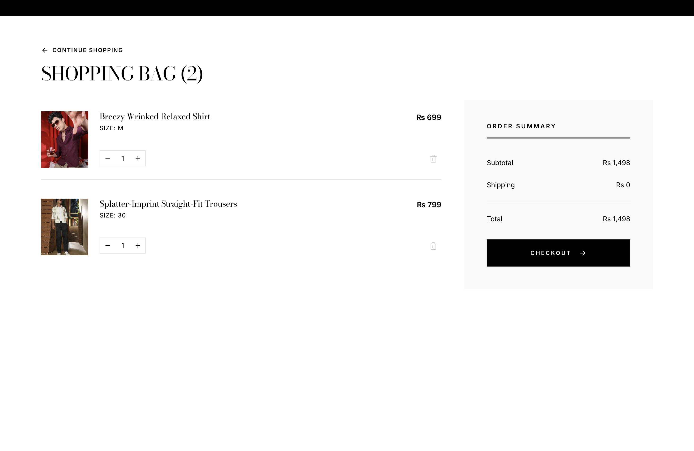
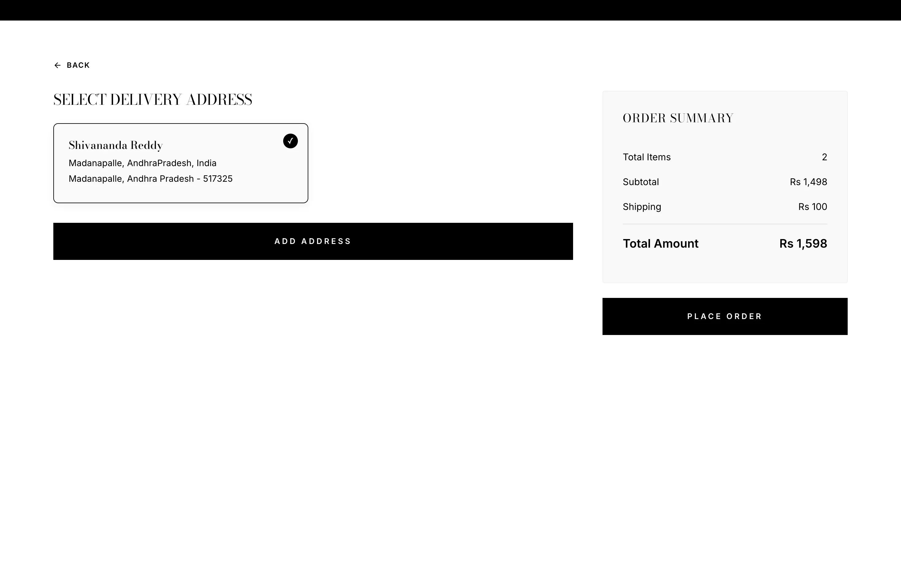
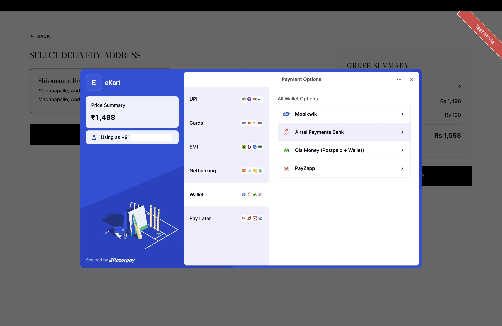
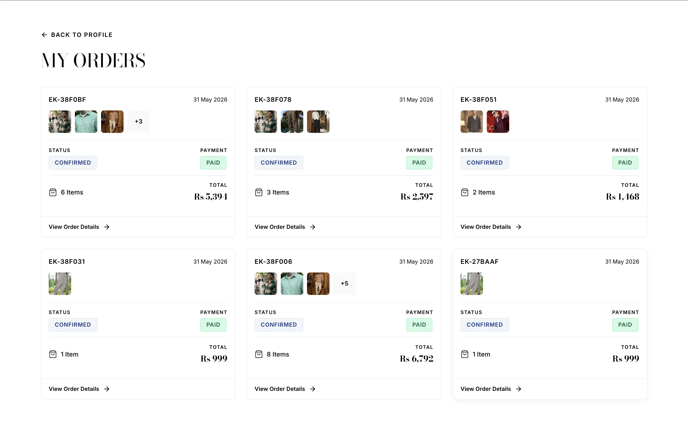

# eKart Frontend

Customer-facing ecommerce frontend for browsing products, managing carts, and placing orders in the eKart platform.

---

## Live Demo

https://ekart-frontend.pages.dev/

---

## Related Repositories

| Repository        | URL                                          |
| :---------------- | :------------------------------------------- |
| eKart Admin Panel | https://github.com/sn0914r/ekart-admin-dashboard |
| eKart Backend     | https://github.com/sn0914r/ekart-backend     |
| eKart System      | https://github.com/sn0914r/eKart-system      |

---

## Features

- Product browsing, search, filtering, and sorting
- Product details with image gallery and variant selection
- Cart and wishlist management
- Checkout and Razorpay payment integration
- Shipping address management
- User authentication and protected routes
- Order history and tracking
- Responsive UI

---

## Tech Stack

### Frontend

- React
- Vite
- React Router

### State Management & Data Fetching

- Zustand
- TanStack Query

### Forms & Validation

- React Hook Form
- Zod

### UI & Styling

- Emotion
- Bootstrap
- Lucide React
- Sonner

---

## Folder Structure

The frontend follows a feature-based architecture with separate modules for authentication, products, cart, checkout, and orders.

```txt
src/
├── app/
│   ├── pages/
│   ├── store/
│   ├── AppRouter.jsx
│   ├── Providers.jsx
│   └── Router.jsx
│
├── features/
│   ├── auth/
│   ├── product/
│   ├── cart/
│   ├── wishlist/
│   ├── checkout/
│   └── order/
│
├── shared/
│   ├── components/
│   └── hooks/
│
├── lib/
│   ├── apiClient.js
│   └── reactQuery.js
│
├── utils/
│
└── constants/
```

---

## Environment Variables

Create a `.env` file in the root directory:

```env
VITE_API_URL=
VITE_RAZORPAY_KEY=
```

---

## Installation

```bash
git clone https://github.com/sn0914r/ekart-frontend.git

cd ekart-frontend

npm install

npm run dev
```

---

## Screenshots

### Home Page


### Product Details


### Shopping Cart



### Checkout



### Payment Gateway



### Orders



---

## Security

- JWT authentication
- Protected routes
- Persistent authentication state
- Centralized API client with authenticated requests
- Automatic token refresh handling
